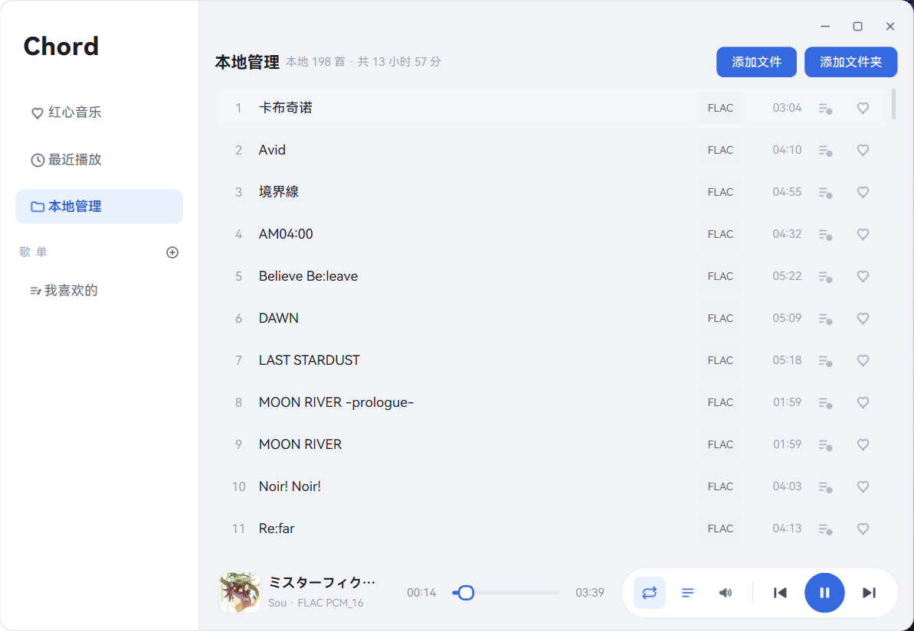
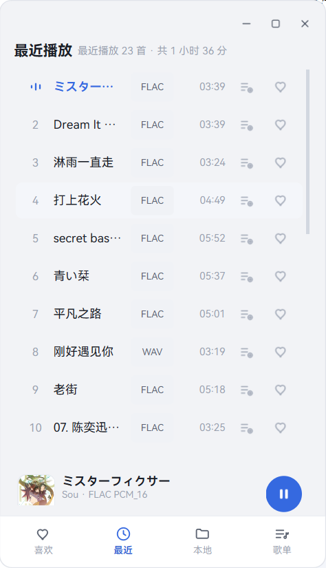
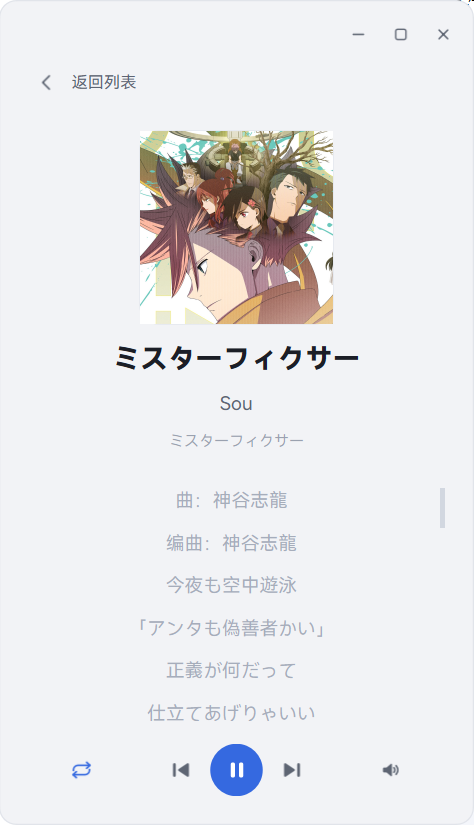
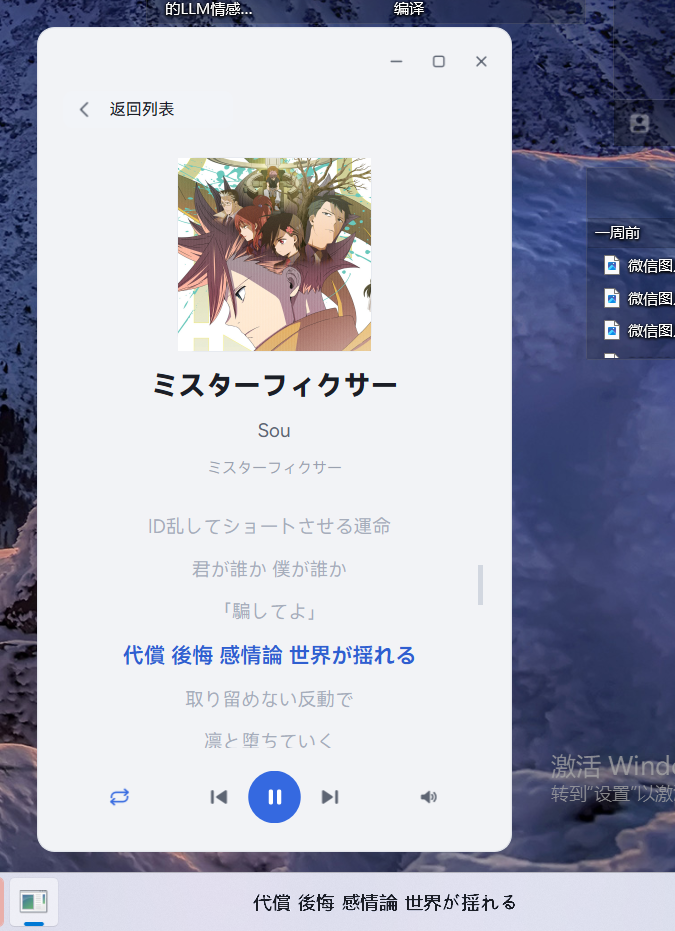

<div align="center">

# Chord · 弦乐音乐播放器

**基于 Python + PySide6 的本地音乐播放器，支持 WAV / FLAC / DTS-WAV 等格式解码播放，遵循 HarmonyOS 设计语言，桌面 / 移动双形态自适应。**

`Python 3.10+` · `PySide6 (Qt 6)` · `FFmpeg / PyAV` · `Windows 10 / 11`

</div>

---

## 效果展示

### 桌面端

本地曲库：白色侧栏导航 + 灰色工作区，播放控制收为右下角白色胶囊。



正在播放详情：左侧专辑封面与曲目信息，右侧逐行同步歌词，当前行高亮并自动滚动居中。


### 移动端形态（窗口拖窄到 720px 以下自动切换）

<table>
<tr>
<td width="50%" align="center">
<br>
侧栏下沉为底部横向导航，播放栏精简为「封面 + 歌名 + 作者 + 播放键」
</td>
<td width="50%" align="center">
<br>
点封面进入沉浸式详情，底部控制条提供循环 / 切歌 / 播放 / 音量
</td>
</tr>
</table>

### Windows 任务栏内嵌歌词

像 TrafficMonitor 一样通过 Win32 `SetParent` 把当前歌词行**真正嵌入任务栏内部**：全透明背景、固定宽度、换段自下而上进场、超宽匀速左滚，并自动跟随深浅色主题与 Explorer 重启重挂载。



---

## 功能特性

### 音频解码与播放

- **多格式解码**
  - WAV：标准库 `wave` 解析 RIFF/PCM，支持 8 / 16 / 24 / 32-bit、单/立体声，统一归一化为 16-bit PCM；非整数 PCM 自动回退 libsndfile；
  - FLAC：`soundfile`（捆绑 libsndfile）无损解码；
  - **真实编码探测 + FFmpeg 通用解码**（`ffmpeg_decoder.py`，PyAV）：不盲信文件头，先扫描码流识别真实编码，覆盖 **DTS-WAV（DTS-CD / DTS-ES）** 以及 MP3 / AAC / M4A / OGG / Opus / APE / WMA；未安装 PyAV 时自动回退 WAV/FLAC 路径。
  - 任意输入统一输出 16-bit / 小端 / 交错立体声 PCM，播放层只处理一种格式。
- **DTS-WAV 专项**：一类 `.wav` 文件头伪装成 44.1k/16bit/双声道 PCM、data 里却是 DTS 6.1 压缩码流，按 PCM 直读只会听到“滋滋”噪声。本项目由 FFmpeg 解码并经 libswresample 专业下混为真实立体声。
- **声道自适应**：单声道复制为左右、立体声直通，5.1 / 7.1 等多声道按标准系数（中央 −3dB、环绕/低音炮加权）下混并限幅防爆音。
- **播放引擎**：`QAudioSink` pull 模式，支持播放/暂停/停止、拖动 seek、上下首、播完自动切歌；输出前在后台线程重采样并转换为**声卡原生格式**（如 USB 声卡常见的 48kHz/Float32），尽量不依赖驱动转换。
- **暂停缓出 / 恢复淡入**：暂停时增益在约 220ms 内收束到 0 再挂起设备，避免硬切“咔”声；恢复时约 170ms 淡入，缓出途中再按播放可立即反向恢复。
- **播放模式**：列表循环 / 单曲循环 / 随机播放三态切换。

### 媒体库与元数据

- **后台线程不卡 UI**：目录递归扫描、时长探测、元数据读取在独立 `QThread`，整曲解码放入 `QThreadPool`；连点切歌用递增 token 丢弃过期结果防“串歌”，导入大文件夹时界面与声音都不卡顿。
- **内嵌元数据（mutagen）**：读取标题 / 艺术家 / 专辑 / 专辑封面 / 同步歌词（Vorbis Comment、ID3v2、APIC、USLT），并修复 UTF-16 USLT 被逐字符拆裂的问题。
- **外部 LRC 退化**：内嵌无同步歌词时自动查找同目录同名 `.lrc`，自动识别 UTF-8 / GB18030 / Big5 编码（兼容老 GBK 歌词），用 `[ti]/[ar]/[al]` 补全缺失信息；都没有才显示“暂无歌词”。
- **三个列表**：本地、最近播放（去重、最多 50 条）、红心收藏；歌曲行含序号、播放均衡条指示、源格式标签、时长、加入歌单与收藏按钮。
- **歌单**：新建 / 重命名 / 删除、把歌曲加入指定歌单（自动去重保序）、歌单内移除、右键播放全部；以 JSON 原子写入本地，重启保留。
- **配置记忆**：曲库、最近、红心、歌单、音量、播放模式、窗口几何与上次播放进度，关闭时保存、下次启动自动恢复（恢复曲目后定位到退出时刻但保持暂停，不会突然出声）。

### 界面与交互（HarmonyOS 设计语言）

- **双形态响应式**：桌面为左侧栏 + 工作区布局；宽度收窄到 720px 以下自动切换移动形态——侧栏下沉为底部横向导航、播放栏精简、详情上下重排，拉宽自动还原。
- **无边框窗口**：仅顶部两条独立条带可拖拽移动、双击最大化；Win32 `WM_NCHITTEST` 实现四边/四角原生缩放，并通过 `WM_NCCALCSIZE` 消除缩放闪烁与残影。
- **高 DPI 自适应**：创建应用前固定 PassThrough 缩放策略，125% / 150% 等非整数缩放下文字与矢量图标依旧清晰，跨屏移动按新像素比重绘。
- **应用自绘对话框**：新建 / 重命名 / 删除 / 提示均为无边框圆角、中文按钮、品牌蓝主按钮，不使用系统原生弹窗。
- **音量浮层**：默认仅一个喇叭，点击浮出竖向音量条与一键静音，点外部自动收起，纯白圆角不透底。
- **轻动效**：页面淡入、图标按压缩小 / 释放回弹、播放键回弹，节奏参考 HarmonyOS 设计指南，克制不花哨。
- **不自绘控件**：图标全部为 24 网格单色 SVG，由 `theme.py` 用 QtSvg 按需着色、按设备像素比高清渲染；字体随应用分发 HarmonyOS Sans，无需用户安装。

### 快捷键

| 按键 | 功能 |
| --- | --- |
| `空格` | 播放 / 暂停 |
| `←` / `→` | 快退 / 快进 5 秒 |
| `Ctrl + ←` / `Ctrl + →` | 上一首 / 下一首 |
| `↑` / `↓` | 音量加 / 减 |

---

## 技术栈

| 模块 | 选型 |
| --- | --- |
| GUI 框架 | PySide6 ≥ 6.6（Qt for Python） |
| 音频输出 | Qt Multimedia `QAudioSink`（pull 模式） |
| WAV / FLAC 解码 | Python 标准库 `wave`、`soundfile`（libsndfile） |
| 通用 / 压缩格式解码 | PyAV（FFmpeg / libswresample） |
| 元数据与标签 | mutagen（ID3v2 / Vorbis Comment / APIC / USLT） |
| 数值处理 | numpy（重采样、下混、限幅、任务栏文字合成） |
| 任务栏歌词 | Windows User32 / GDI / DWM（ctypes，`SetParent` 重父化） |

---

## 安装与运行

```bash
# 1. 克隆仓库
git clone https://github.com/SakalioLabs/Chord-Music.git
cd Chord-Music

# 2. 安装依赖（建议虚拟环境，Python 3.10+）
pip install -r requirements.txt

# 3. 启动
python main.py
```

> - Windows 上 `soundfile` 的 wheel 已捆绑 libsndfile；`av` 的 wheel 已捆绑 FFmpeg，无需另行安装。
> - 播放需要系统存在可用的音频输出设备；任务栏内嵌歌词为 Windows 专属能力，其它平台自动隐藏入口。

## 使用

1. 进入「本地管理」，点击「添加文件 / 添加文件夹」导入音频（空库时也可点中央「添加音乐」）；
2. **双击列表歌曲**开始播放，点心形收藏，「最近播放 / 红心音乐」自动更新；
3. 拖动进度条跳转，底部胶囊控制切歌 / 模式 / 音量；点封面或歌名进入正在播放详情查看歌词；
4. 拖窄窗口体验移动形态；「三横线」按钮开启 Windows 任务栏内嵌歌词。

---

## 目录结构

```
Chord-Music/
├─ main.py                  # 入口：高DPI、字体、QSS、主窗口
├─ requirements.txt
├─ assets/
│  ├─ fonts/                # 随应用分发的 HarmonyOS Sans
│  ├─ icons/                # 24 网格单色 SVG 图标
│  └─ images/               # 默认头像等图片资源
├─ app/
│  ├─ decoder.py            # PCM WAV / FLAC 解码与多声道下混
│  ├─ ffmpeg_decoder.py     # PyAV(FFmpeg)：DTS-WAV/MP3/AAC 等真实解码
│  ├─ audio_convert.py      # 重采样 / 样本格式转换，输出声卡原生格式
│  ├─ engine.py             # QAudioSink 播放引擎（含暂停缓出/恢复淡入）
│  ├─ metadata.py           # 内嵌标签 / 歌词 / 封面 + 外部 LRC 退化
│  ├─ workers.py            # 后台线程：批量导入(QThread) + 异步解码(QThreadPool)
│  ├─ store.py              # 歌单与设置的本地持久化（JSON 原子写）
│  ├─ dialogs.py            # 应用自绘输入 / 确认 / 提示对话框
│  ├─ frameless.py          # Win32 无边框窗口缩放与去闪（仅 Windows）
│  ├─ taskbar_lyrics.py     # Win32 任务栏内嵌歌词窗（SetParent，仅 Windows）
│  ├─ now_playing.py        # 正在播放详情（封面 + 同步歌词 + 移动控制条）
│  ├─ widgets.py            # 歌曲行、音量浮层等控件
│  ├─ theme.py              # 高DPI / 字体 / SVG 图标 / 封面渲染
│  ├─ animation.py          # HarmonyOS 风格轻动效
│  ├─ main_window.py        # 主窗口布局、响应式与交互
│  └─ style.qss             # 全局设计令牌与样式
├─ docs/images/             # README 效果图
├─ samples/                 # 各格式测试音频
└─ scripts/                 # 自测 / 回归 / 渲染脚本
```

---

## 自测与回归

`scripts/` 内置一套无人工干预的回归脚本，覆盖解码正确性、声道下混、DTS 识别、异步线程、
歌单持久化、响应式形态、无边框缩放命中、音量浮层、动效生命周期、任务栏歌词逻辑等：

```bash
python scripts/selftest_decode.py        # 解码与 libsndfile 位级比对
python scripts/verify_channels.py        # 单声道 / 5.1 / 7.1 下混与限幅
python scripts/verify_dts.py             # DTS-WAV 伪装识别与真实解码
python scripts/verify_async.py           # 后台导入 / 异步解码不阻塞、防串歌
python scripts/verify_responsive.py      # 桌面 ↔ 移动形态切换（48 项）
python scripts/verify_frameless.py       # 边缘缩放命中测试（12 项）
python scripts/verify_playlists.py       # 歌单增删改与持久化
python scripts/verify_metadata.py        # 内嵌标签 / 外部 LRC / 编码识别
# 其余：smoke_ui / verify_drag / verify_animations / verify_volume_popup /
#       verify_playback_modes / verify_fade / verify_taskbar_lyrics ...
```

---

## 数据存储位置

应用只在本地读写，不上传任何数据。歌单与设置以 JSON 原子写入用户目录：

- Windows：`%LOCALAPPDATA%\Chord\playlists.json`（歌单）、`settings.json`（设置记忆）

文件损坏时按字段级容错回退默认值，不影响启动。

---

## 许可证

本项目基于 [MIT License](LICENSE) 开源。

